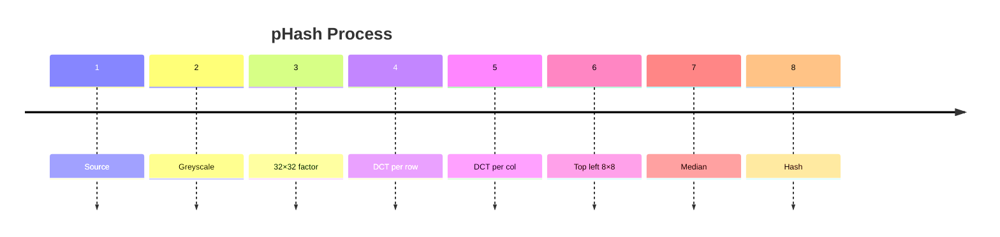
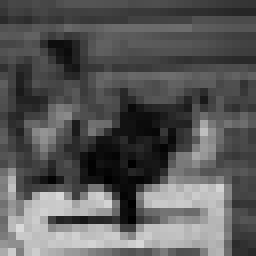
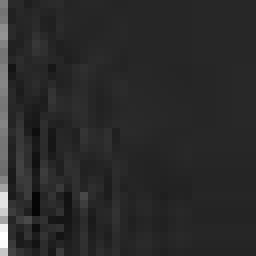
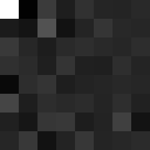
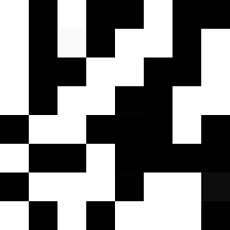
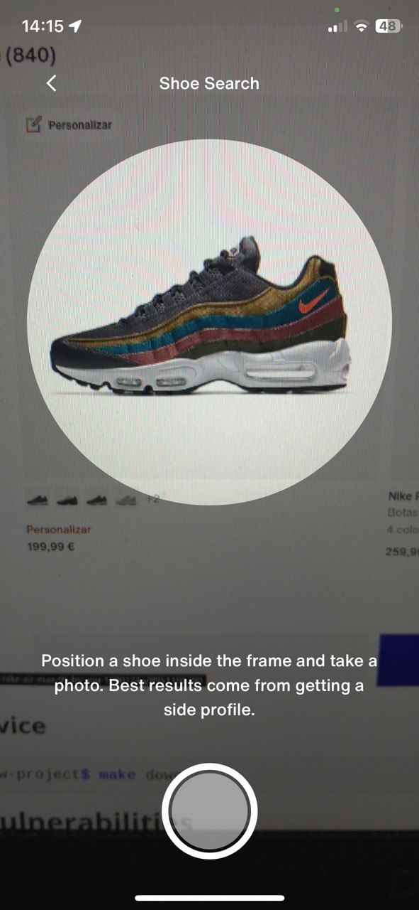

[](https://github.com/AlcidesRC/cv-searching-similar-images/actions/workflows/ci.yml)

# CV: Searching Similar Images

[TOC]

> [!TIP]
>
> This `Markdown` document contains some [Mermaid](https://mermaid.js.org/) diagrams so please consider install [Typora](https://typora.io/) to read/manage `Markdown` files and don't miss any advanced feature. 


------


## Introduction

Checking if files are identical is an exceedingly-trivial task – it is possible to directly compare all their bytes or perhaps compute a hash of each file and compare those values -but trying to compare the similarity of files’ content is entirely more difficult.se, greatly reducing the space needed for evaluation.

### What does similarity mean?

How can a computer determine whether two photos contain the same content after getting resized or compressed several times?

Due to the lossy nature of most image compression algorithms, it is impossible to compare the bytes of images to determine whether they have the same content.

Every time a JPEG image is decoded and encoded, additional data is changed or lost. While formats like PNG are lossless, resizing images will also change their content, preventing direct comparisons.

There are a variety of image hashing algorithms, some of the most popular algorithms being:

- Average Hashing (aHash)
- Median Hashing (mHash)
- Perceptual Hashing (pHash)
- Difference Hashing (dHash)
- Block Hashing (bHash)
- Wavelet Hashing (wHash)
- ColorMoment Hashing

Cryptographic hashing algorithms like the `MD5` or `SHA256` are designed to generate an unpredictable result. In order to do this, they are optimized to change as much as possible for similar inputs. Perceptual Hashes are the opposite —they are optimized to change as little as possible for similar inputs.
pHash algorithm computes hashing on top of Discrete Cosine Transform (DCT) that transforms data from spatial domain to frequency domain.

### Perceptual Hashes (pHashes)

As previously noted, this family of algorithms are designed to not  change much when an image undergoes minor modifications such as compression, color correction and brightness. pHashes allows the  comparison of two images by looking at the number of different bits  between the input and the image it is being compared against. This difference is known as [the Hamming distance](https://en.wikipedia.org/wiki/Hamming_distance).

A very simple way of using this algorithm would be to create a list of all known images and their perceptual hash. A hamming distance can be calculated with just a `xor` and `popcnt` instruction on modern CPUs. This  approach would be fairly fast to start with. With tens of thousands of  images, it could be possible to get results in a few seconds, which is  likely acceptable performance.

When the amount of images starts growing to the millions,  sequentially scanning and comparing against every image takes far too  long. Because the hash has to be computed against the input each time, a conventional index would not be usable. 

Thankfully, a [BK-tree](https://en.wikipedia.org/wiki/BK-tree) -a tree specifically designed for metric spaces like Hamming distance-  can be used here instead of having to search against every image in the  database, greatly reducing the space needed for evaluation.

#### How does pHashes work?

##### Process Overview



###### Process Description

| Step | Name         | Description                                                  |
| ---- | ------------ | ------------------------------------------------------------ |
| 1    | Source       |                                                              |
| 2    | Greyscale    |                                                              |
| 3    | 32×32 factor | This case uses a factor of 4, which is why the image is scaled down to (8×4)×(8×4), that is, a 32×32 image. |
| 4    | DCT per row  | To this image, a discrete cosine transform is applied, first per row… |
| 5    | DCT per col  | ...and afterwards per column                                 |
| 6    | Top left 8×8 | The pixels with high frequencies are now located in the upper left  corner, which is why the image is cropped to the upper left 8×8 pixels. |
| 7    | Median       | Next, calculate the median of the gray values in this image. |
| 8    | Hash         | And finally, generate a hash value from the image.           |

#### Example

| Step | Name                  | Image                                                        |
| ---- | --------------------- | ------------------------------------------------------------ |
| 1    | Source                |  |
| 2    | Convert to greyscale  |  |
| 3    | 32×32 factor          |  |
| 4    | DCT per row           |  |
| 5    | DCT per col           |  |
| 6    | Upper left 8×8 factor |  |
| 7    | Median                |  |
| 8    | Hash                  | `1010010010101101100110011011001101100010100100000111011010101110` |


------


### Some relevant use cases

#### Digital Rights Management

Intellectual property rights protection and management of multimedia data is essential for the deployment of e-commerce systems involving transactions on such data.

Early detection of resources under copyright avoids complex and expensive legal issues.

#### Data deduplication

pHash gives a metric about the similarity between two sources, which prevents duplication in the main dataset.

Optimizing the main dataset is not only an improvement in terms of curated contents, but also in terms of costs of infrastructure.

#### Reverse image search engine

E-commerce is a growing industry that has become a notable part of  many consumers’ habits; therefore, many sites are trying to bring new  features to the filtering and comparison tools to improve the user  experience. One such feature is allowing customers to find products by a photo in order to suggest the exact match in case of success or the  most similar products in other cases. This is called a reverse image  search engine.

#### DNA sequencing

Each nucleotide is encoded as a fixed gray level intensity pixel  whose hash is calculated from its significant frequency characteristics. This results in a drastic data reduction between the sequence and the  perceptual hash, allowing scientists and geneticists to perform massive  searches and compare millions of combinations with low infrastructure  impact.

 Web Design for Coding: 7 steps checklist to have it ready for development

#### Detecting signs of disease

In the field of agriculture, there are many destructive diseases, for example leaf diseases that are the most frequent diseases where spots  occur on the leaves. If these spots are not detected on time, they can  cause severe losses. To detect leaf disease, image processing techniques are employed, many of them based on pHashes.


------


## Implementation in PHP

### Overview

This overview is based on [ImageHash](https://github.com/jenssegers/imagehash), a well documented and tested PHP package to hash images.

```php
<?php

[...]

use Jenssegers\ImageHash\ImageHash;
use Jenssegers\ImageHash\Implementations\DifferenceHash;

$hasher = new ImageHash(new DifferenceHash());

$hash1 = $hasher->hash('path/to/image1.jpg');
$hash2 = $hasher->hash('path/to/image2.jpg');

$distance = $hasher->distance($hash1, $hash2);
```

#### Example #1

|                           Image #1                           |                           Image #2                           |
| :----------------------------------------------------------: | :----------------------------------------------------------: |
|  |  |

| **Image** | **pHash**                                                    |
| --------- | ------------------------------------------------------------ |
| #1        | 00111100001111100000111000**0**11**0**1000111**0**10000111100001111000011110 |
| #2        | 00111100001111100000111000**1**11**1**1000111**1**10000111100001111000011110 |


> [!IMPORTANT]
>
> A comparison of the binary hash reveals only 3 different bits, so **the Hamming distance is 3**.


#### Example #2

|                           Image #1                           |                           Image #2                           |
| :----------------------------------------------------------: | :----------------------------------------------------------: |
|  |  |

| **Image** | **pHash**                                                    |
| --------- | ------------------------------------------------------------ |
| #1        | 0**0**1**01**0001**0**1**01**0001**0**1**01**0**0**01**0101**0**001010**10110**0**1**0101**10**10**101**1**10**0110**111 |
| #2        | 0**1**1**10**0001**1**1**10**0001**1**1**10**0**1**01**1010**0**110101**10110**1**1**1010**10**01**101**0**10**1001**111 |


> [!IMPORTANT]
>
> A comparison of the binary hash reveals 32 different bits, so **the Hamming distance is 32**.


------


## Use Case: Reverse Image Search Engine

### Preamble

This use case is based on [Nike.es](https://www.nike.com/es), the Spanish branch of Nike.com.

Comparing the native application and the website we can see two different UX when looking for sneakers:

#### Native Application

When using the native application you can find sneakers by navigating their catalog or just taking a photo of the desired one. If there is a coincidence, the application redirects the user to the matching product detail view but, in any other case, the catalog is sorted out to show the sneakers sorted by similarity. 

##### Screenshot



#### Web Application

But when visiting the web application this feature is missing. There is no any way to filter out sneakers by similarity. 

##### Screenshot


### Introduction

This repository shows how to implement a this feature applying a reverse image search engine. 


> [!IMPORTANT]
>
> Provided version is not a full clone neither a full-featured [Nike.es](https://www.nike.com/es/w/hombre-zapatillas-nik1zy7ok) website version. It's just a VueJS component to show you how to improve the UX searching by similarity.


Remarked in purple you will find some new elements:

- Closed to the main search input field there is a camera icon from where the customer could upload some pictures (or capture some snapshots using the camera) to filter out the catalog. (To simplify the process some predefined photos are provided to filter out the catalog.)

- Once the photo is clicked the entire catalog is automatically sorted out by similarity.

#### Screenshot


#### Technical Requirements

| Tool   | Required/Recommended | Description                                  |
| ------ | -------------------- | -------------------------------------------- |
| Git    | Required             | To interact with the VCS repository          |
| Docker | Required             | To manage the development environment        |
| Make   | Recommended          | To interact with the development environment |
| jq     | Recommended          | To inspect the Docker services health        |

##### Makefile

A `Makefile` is provided with some predefined commands to improve the Development Experience.

 

> [!IMPORTANT]
>
> To make use of `Makefile` is required to install `make` on your host machine.
>
> You can always execute the commands in the way you prefer (aliases, bash scripts...) but it's highly recommended to use a `Makefile` to standardize used commands and their options across the development team. 


###### Available Commands

```text
╔════════════════════════════════════════════════════════════════════════════════════════════════╗
║                                                                                                ║
║                                    .: AVAILABLE COMMANDS :.                                    ║
║                                                                                                ║
╚════════════════════════════════════════════════════════════════════════════════════════════════╝
· DOMAIN(s) .... https://localhost
· SERVICE(s) ... caddy app1
· USER ......... (1000) alcidesramos
· GROUP ........ (1000) alcidesramos

· build                               Docker: builds the service <env=[dev|prod]>
· up                                  Docker: starts the service <env=[dev|prod]>
· restart                             Docker: restarts the service <env=[dev|prod]>
· down                                Docker: stops the service <env=[dev|prod]>
· logs                                Docker: exposes the service logs <env=[dev|prod]> <service=[app1|caddy]>
· shell                               Docker: establish a shell session into main container
· inspect                             Docker: inspect the health for specific service <service=[app1|caddy]>
· install-caddy-certificate           Setup: extracts the Caddy Local Authority certificate
· composer-dump                       Composer: runs <composer dump-auto>
· composer-install                    Composer: runs <composer install>
· composer-remove                     Composer: runs <composer remove>
· composer-require-dev                Composer: runs <composer require --dev>
· composer-require                    Composer: runs <composer require>
· composer-update                     Composer: runs <composer update>
· check-syntax                        Application: runs PHP linter
· check-style                         Application: runs PHP Code Sniffer
· fix-style                           Application: runs PHP Code Beautifier and Fixer
· phpstan                             Application: runs PHPStan
· phpmd                               Application: runs PHP Mess Detector
· tests                               Application: runs PHPUnit testsuite
· open-website                        Application: open the application website
· init                                Application: initializes the application
```


------


#### Development Environment


> [!IMPORTANT]
>
> This development environment is based on [Dockerized PHP](https://github.com/fonil/dockerized-php), a framework agnostic *dockerized* environment to create and deploy PHP applications.
>
> Please take a look to the [README.md](https://github.com/fonil/dockerized-php/blob/main/README.md) file to know how to familiarize with it and get up and running.


##### Application Service

Application Service is based only on a Docker container based on `php:8.3.12-fpm-alpine` and some useful extensions used during the development process such as `PCOV`,`xDebug`, etc.


###### Quickstart

```bash
$ make init
```


------


> Updated At: `2024-11-14`
